# The Stampede Problem: Understanding and Solving Resource Contention

## Table of Contents
- [What is the Stampede Problem?](#what-is-the-stampede-problem)
- [Demo Implementation Overview](#demo-implementation-overview)
- [Resource Store Implementations](#resource-store-implementations)
- [Problem Scenarios](#problem-scenarios)
- [Visual Flow Diagrams](#visual-flow-diagrams)
- [Implementation Examples](#implementation-examples)
- [Performance Comparison](#performance-comparison)
- [Best Practices](#best-practices)

## What is the Stampede Problem?

The **Stampede Problem** (also known as the **Thundering Herd Problem**) occurs when multiple processes or threads simultaneously compete for the same limited resource, leading to:

- **Performance degradation**
- **Resource exhaustion**
- **Potential deadlocks**
- **Cascading failures**
- **Poor user experience**

### Common Scenarios
- Database connection pool exhaustion
- Cache invalidation and regeneration
- File system access bottlenecks
- API rate limiting issues
- Memory allocation conflicts

## Demo Implementation Overview

This demonstration uses fruit-themed resource examples to illustrate the stampede problem with the following key components:

### Core Data Models

**ResourceExample Class:**
```csharp
public class ResourceExample
{
    public Guid Guid { get; set; } = Guid.NewGuid();
    public string Name { get; set; } = string.Empty;
    
    public override string ToString() => $"{{\"id\":{Guid}, \"name\":{Name}}}";
}
```

**Static Resource Data:**
```csharp
public static string[] ResourceNames = [
    "Apple", "Banana", "Cherry", "Orange", "Grape",
    "Strawberry", "Blueberry", "Pineapple", "Mango", "Peach"
];
```

**Real-time Logging Integration:**
All resource stores support dependency injection of `IRealTimeLogService` for live monitoring:
```csharp
public interface IRealTimeLogService
{
    void Log(string message, LogLevelInternal level = LogLevelInternal.Information, 
             string? source = null, bool highlighted = false);
    void Clear();
    event Action<LogEntry>? LogEntryAdded;
}
```

## Resource Store Implementations

This demo includes four different implementations that demonstrate various aspects of the stampede problem:

### 1. SimpleResourceStore (Baseline)

**Purpose:** Demonstrates normal resource fetching with configurable delays.

```csharp
public class SimpleResourceStore(int delayMs = 200, IRealTimeLogService? logger = null)
{
    public virtual async Task<List<ResourceExample>> GetRandomResourcesAsync()
    {
        var threadId = Thread.CurrentThread.ManagedThreadId;
        _logger?.Log($"Thread {threadId}: Starting to fetch 10 random resources...", 
                    LogLevelInternal.Information, "SimpleResourceStore");
        
        var resources = new List<ResourceExample>();
        for (int i = 0; i < 10; i++)
        {
            var randomName = ResourceStaticData.ResourceNames[_random.Next(ResourceStaticData.ResourceNames.Length)];
            await Task.Delay(_delayMs);
            resources.Add(new ResourceExample { Name = randomName });
        }
        
        _logger?.Log($"Thread {threadId}: Completed fetching 10 resources after {_delayMs}ms", 
                    LogLevelInternal.Information, "SimpleResourceStore");
        return resources;
    }
}
```

**Characteristics:**
- Returns 10 random fruit resources
- Configurable delay simulation (default: 200ms)
- Comprehensive logging with thread ID tracking
- Virtual method for inheritance

### 2. DeadlockProneResourceStore (Deadlock Demonstration)

**Purpose:** Demonstrates how improper locking can cause deadlocks.

```csharp
public class DeadlockProneResourceStore(int delayMs = 300, IRealTimeLogService? logger = null)
    : SimpleResourceStore(delayMs, logger)
{
    private static readonly object _lock1 = new object();
    private static readonly object _lock2 = new object();

    public override async Task<List<ResourceExample>> GetRandomResourcesAsync()
    {
        var threadId = Thread.CurrentThread.ManagedThreadId;
        
        return await Task.Run(async () =>
        {
            if (threadId % 2 == 0)
            {
                // Even threads: lock1 → lock2
                lock (_lock1)
                {
                    _logger?.Log($"Thread {threadId}: Acquired lock1, waiting before lock2...", 
                                LogLevelInternal.Warning, "DeadlockProneResourceStore");
                    Thread.Sleep(150);
                    lock (_lock2)
                    {
                        return await base.GetRandomResourcesAsync();
                    }
                }
            }
            else
            {
                // Odd threads: lock2 → lock1 (DEADLOCK RISK!)
                lock (_lock2)
                {
                    _logger?.Log($"Thread {threadId}: Acquired lock2, waiting before lock1...", 
                                LogLevelInternal.Warning, "DeadlockProneResourceStore");
                    Thread.Sleep(150);
                    lock (_lock1)
                    {
                        return await base.GetRandomResourcesAsync();
                    }
                }
            }
        });
    }
}
```

**Deadlock Mechanism:**
- Even threads acquire locks in order: `_lock1` → `_lock2`
- Odd threads acquire locks in order: `_lock2` → `_lock1`
- When both types run simultaneously, circular waiting occurs
- 150ms sleep increases deadlock probability

### 3. CachedResourceStore (Basic Caching - Race Condition Prone)

**Purpose:** Shows basic caching implementation that's vulnerable to race conditions.

```csharp
public class CachedResourceStore : SimpleResourceStore, IDisposable
{
    private readonly IMemoryCache _cache;
    private readonly TimeSpan _cacheExpiration = TimeSpan.FromMinutes(10);
    private const string CACHE_KEY = "RandomResources";

    public override async Task<List<ResourceExample>> GetRandomResourcesAsync()
    {
        var threadId = Thread.CurrentThread.ManagedThreadId;
        
        if (!_cache.TryGetValue(CACHE_KEY, out List<ResourceExample>? cachedResources) || cachedResources == null)
        {
            // RACE CONDITION: Multiple threads can reach here simultaneously
            _logger?.Log($"Thread {threadId}: Cache MISS - Loading resources from store", 
                        LogLevelInternal.Information, "CachedResourceStore", true);
                        
            var resources = await base.GetRandomResourcesAsync(); // Multiple calls possible!
            
            var cacheOptions = new MemoryCacheEntryOptions
            {
                AbsoluteExpirationRelativeToNow = _cacheExpiration,
                Priority = CacheItemPriority.Normal
            };
            _cache.Set(CACHE_KEY, resources, cacheOptions);
            cachedResources = resources;
        }

        _logger?.Log($"Thread {threadId}: Cache HIT - Returning cached resources", 
                    LogLevelInternal.Information, "CachedResourceStore");
        return cachedResources;
    }
}
```

**Race Condition Issues:**
- Multiple threads can simultaneously detect cache miss
- Results in multiple expensive `base.GetRandomResourcesAsync()` calls
- Demonstrates why basic caching isn't thread-safe

### 4. ThreadSafeCachedResourceStore (Optimal Solution)

**Purpose:** Demonstrates the correct, thread-safe caching implementation.

```csharp
public class ThreadSafeCachedResourceStore : SimpleResourceStore, IDisposable
{
    private readonly IMemoryCache _cache;
    private readonly TimeSpan _cacheExpiration = TimeSpan.FromMinutes(10);
    private const string CACHE_KEY = "RandomResources";
    private ConcurrentDictionary<string, SemaphoreSlim> _semaphoreDictionary = [];

    public override async Task<List<ResourceExample>> GetRandomResourcesAsync()
    {
        var threadId = Thread.CurrentThread.ManagedThreadId;

        if (!_cache.TryGetValue(CACHE_KEY, out List<ResourceExample>? cachedResources) || cachedResources == null)
        {
            try
            {
                SemaphoreSlim semaphore = _semaphoreDictionary.GetOrAdd(CACHE_KEY, _ => new(1, 1));
                await semaphore.WaitAsync();
                
                // Double-check pattern
                if (_cache.TryGetValue(CACHE_KEY, out var existingValue))
                {
                    _logger?.Log($"Thread {threadId}: Store data already loaded and populated.", 
                                LogLevelInternal.Information, "ThreadSafeCachedResourceStore");
                    return (List<ResourceExample>?)existingValue!;
                }

                _logger?.Log($"Thread {threadId}: Cache MISS Step forward - Loading resources from store", 
                            LogLevelInternal.Information, "ThreadSafeCachedResourceStore", true);

                var resources = await base.GetRandomResourcesAsync(); // Only one thread executes this
                
                var cacheOptions = new MemoryCacheEntryOptions
                {
                    AbsoluteExpirationRelativeToNow = _cacheExpiration,
                    Priority = CacheItemPriority.Normal
                };
                _cache.Set(CACHE_KEY, resources, cacheOptions);
                cachedResources = resources;
            }
            finally
            {
                if (_semaphoreDictionary.TryGetValue(CACHE_KEY, out var semaphore)) 
                    semaphore.Release();
            }
        }

        _logger?.Log($"Thread {threadId}: Cache HIT - Returning cached resources", 
                    LogLevelInternal.Information, "ThreadSafeCachedResourceStore");
        return cachedResources;
    }
}
```

**Thread Safety Features:**
- Uses `ConcurrentDictionary<string, SemaphoreSlim>` for per-key locking
- Double-check pattern prevents race conditions
- Proper async/await with semaphore handling
- Comprehensive disposal management

## Problem Scenarios

### 1. SimpleResourceStore (Baseline - No Protection)


### 2. DeadlockProneResourceStore (Deadlock Demonstration)



```mermaid
sequenceDiagram
    participant Thread1 as Thread 2 (Even)
    participant Thread2 as Thread 3 (Odd)
    participant Thread3 as Thread 4 (Even)
    participant Lock1 as Static Lock1
    participant Lock2 as Static Lock2
    participant DeadlockStore as DeadlockProneResourceStore

    Note over Thread1,Thread3: Even threads vs Odd threads with different lock ordering

    Thread1->>DeadlockStore: GetRandomResourcesAsync()
    Thread2->>DeadlockStore: GetRandomResourcesAsync()
    Thread3->>DeadlockStore: GetRandomResourcesAsync()

    Note over DeadlockStore: Even threads: Lock1 → Lock2

    DeadlockStore->>Lock1: Acquire Lock1 (Thread 2)
    DeadlockStore->>Lock2: Acquire Lock2 (Thread 3)
    DeadlockStore->>Lock1: Acquire Lock1 (Thread 4)
    
    Note over DeadlockStore: 150ms sleep creates contention window
    
    DeadlockStore-xLock2: Wait for Lock2 (Thread 2) ❌
    DeadlockStore-xLock1: Wait for Lock1 (Thread 3) ❌

    Note over Thread1,Lock2: DEADLOCK! Thread 2 has Lock1, needs Lock2
    Note over Thread1,Lock2: Thread 3 has Lock2, needs Lock1
    
    rect rgb(255, 200, 200)
        Note over Thread1,Thread3: Circular wait - System hangs indefinitely
    end
```

### 3. CachedResourceStore (Race Condition Prone)


### 4. ThreadSafeCachedResourceStore (Optimal Solution)


## Visual Flow Diagrams

### Resource Access Patterns


### Cache Lifecycle


## Implementation Examples

### Real-Time Monitoring with IRealTimeLogService

All resource stores in this demo support real-time logging through dependency injection:

```csharp
public interface IRealTimeLogService
{
    event Action<LogEntry>? LogEntryAdded;
    void Log(string message, LogLevelInternal level = LogLevelInternal.Information, 
             string? source = null, bool highlighted = false);
    void Clear();
}

public enum LogLevelInternal
{
    Debug,           // 🔍 Detailed resource information
    Information,     // ℹ️ Normal operations
    Warning,         // ⚠️ Potential issues (deadlock attempts)
    Error,           // ❌ Critical failures
    HighLighted      // ✨ Important cache misses
}
```

### 1. SimpleResourceStore Implementation

**Use Case:** Baseline implementation for performance comparison.

```csharp
public class SimpleResourceStore(int delayMs = 200, IRealTimeLogService? logger = null)
{
    private readonly Random _random = new();
    private readonly int _delayMs = delayMs;
    protected readonly IRealTimeLogService? _logger = logger;

    public virtual async Task<List<ResourceExample>> GetRandomResourcesAsync()
    {
        var threadId = Thread.CurrentThread.ManagedThreadId;
        var message = $"Thread {threadId}: Starting to fetch 10 random resources...";
        
        Console.WriteLine($"[{DateTime.Now:HH:mm:ss.fff}] {message}");
        _logger?.Log(message, LogLevelInternal.Information, "SimpleResourceStore");
        
        var resources = new List<ResourceExample>();
        for (int i = 0; i < 10; i++)
        {
            var randomName = ResourceStaticData.ResourceNames[_random.Next(ResourceStaticData.ResourceNames.Length)];
            await Task.Delay(_delayMs); // Simulate work
            resources.Add(new ResourceExample { Name = randomName });
        }

        var completedMessage = $"Thread {threadId}: Completed fetching 10 resources after {_delayMs}ms";
        Console.WriteLine($"[{DateTime.Now:HH:mm:ss.fff}] {completedMessage}");
        _logger?.Log(completedMessage, LogLevelInternal.Information, "SimpleResourceStore");
        
        return resources;
    }
}
```

**Characteristics:**
- ✅ Simple and predictable
- ✅ Virtual method allows inheritance
- ❌ No protection against concurrent access
- ❌ Each request generates new resources

### 2. DeadlockProneResourceStore Implementation

**Use Case:** Demonstrates deadlock vulnerabilities in multi-threaded scenarios.

```csharp
public class DeadlockProneResourceStore(int delayMs = 300, IRealTimeLogService? logger = null)
    : SimpleResourceStore(delayMs, logger)
{
    private static readonly object _lock1 = new object();
    private static readonly object _lock2 = new object();

    public override async Task<List<ResourceExample>> GetRandomResourcesAsync()
    {
        var threadId = Thread.CurrentThread.ManagedThreadId;
        
        return await Task.Run(async () =>
        {
            if (threadId % 2 == 0)
            {
                // Even threads: lock1 → lock2
                _logger?.Log($"Thread {threadId}: Attempting to acquire lock1...", 
                            LogLevelInternal.Warning, "DeadlockProneResourceStore");
                lock (_lock1)
                {
                    _logger?.Log($"Thread {threadId}: Acquired lock1, waiting before lock2...", 
                                LogLevelInternal.Warning, "DeadlockProneResourceStore");
                    Thread.Sleep(150); // Increase deadlock probability
                    
                    lock (_lock2)
                    {
                        _logger?.Log($"Thread {threadId}: Acquired both locks, delegating to SimpleResourceStore", 
                                    LogLevelInternal.Information, "DeadlockProneResourceStore");
                        return await base.GetRandomResourcesAsync();
                    }
                }
            }
            else
            {
                // Odd threads: lock2 → lock1 (DEADLOCK RISK!)
                _logger?.Log($"Thread {threadId}: Attempting to acquire lock2...", 
                            LogLevelInternal.Warning, "DeadlockProneResourceStore");
                lock (_lock2)
                {
                    _logger?.Log($"Thread {threadId}: Acquired lock2, waiting before lock1...", 
                                LogLevelInternal.Warning, "DeadlockProneResourceStore");
                    Thread.Sleep(150); // Increase deadlock probability
                    
                    lock (_lock1)
                    {
                        _logger?.Log($"Thread {threadId}: Acquired both locks, delegating to SimpleResourceStore", 
                                    LogLevelInternal.Information, "DeadlockProneResourceStore");
                        return await base.GetRandomResourcesAsync();
                    }
                }
            }
        });
    }
}
```

**Deadlock Mechanism:**
- 🔴 **Critical Flaw:** Different lock ordering per thread
- ⚠️ Even threads: `_lock1` → `_lock2`
- ⚠️ Odd threads: `_lock2` → `_lock1`
- 💥 **Result:** Circular waiting when both types run simultaneously

### 3. CachedResourceStore Implementation

**Use Case:** Basic caching with race condition vulnerability (educational purpose).

```csharp
public class CachedResourceStore : SimpleResourceStore, IDisposable
{
    private readonly IMemoryCache _cache;
    private readonly TimeSpan _cacheExpiration = TimeSpan.FromMinutes(10);
    private const string CACHE_KEY = "RandomResources";

    public CachedResourceStore(int delayMs = 200, IRealTimeLogService? logger = null)
        : base(delayMs, logger)
    {
        _cache = new MemoryCache(new MemoryCacheOptions());
    }

    public override async Task<List<ResourceExample>> GetRandomResourcesAsync()
    {
        var threadId = Thread.CurrentThread.ManagedThreadId;
        
        if (!_cache.TryGetValue(CACHE_KEY, out List<ResourceExample>? cachedResources) || cachedResources == null)
        {
            // ⚠️ RACE CONDITION: Multiple threads can reach here simultaneously
            var cacheMissMessage = $"Thread {threadId}: Cache MISS - Loading resources from store";
            Console.WriteLine($"[{DateTime.Now:HH:mm:ss.fff}] {cacheMissMessage}");
            _logger?.Log(cacheMissMessage, LogLevelInternal.Information, "CachedResourceStore", true);

            var resources = await base.GetRandomResourcesAsync(); // Multiple expensive calls possible!
            
            var cacheOptions = new MemoryCacheEntryOptions
            {
                AbsoluteExpirationRelativeToNow = _cacheExpiration,
                Priority = CacheItemPriority.Normal
            };
            _cache.Set(CACHE_KEY, resources, cacheOptions);
            cachedResources = resources;
        }

        var cacheHitMessage = $"Thread {threadId}: Cache HIT - Returning cached resources";
        Console.WriteLine($"[{DateTime.Now:HH:mm:ss.fff}] {cacheHitMessage}");
        _logger?.Log(cacheHitMessage, LogLevelInternal.Information, "CachedResourceStore");
        
        return cachedResources;
    }

    public void ClearCache()
    {
        _cache.Remove(CACHE_KEY);
        _logger?.Log("Cache cleared", LogLevelInternal.Information, "CachedResourceStore");
    }

    public void Dispose() => _cache.Dispose();
}
```

**Race Condition Problems:**
- 🟡 **Issue:** Multiple threads can detect cache miss simultaneously
- 📉 **Result:** Multiple calls to expensive `base.GetRandomResourcesAsync()`
- 🎯 **Purpose:** Demonstrates why basic caching isn't sufficient

### 4. ThreadSafeCachedResourceStore Implementation (Recommended)

**Use Case:** Production-ready, thread-safe caching with optimal performance.

```csharp
public class ThreadSafeCachedResourceStore : SimpleResourceStore, IDisposable
{
    private readonly IMemoryCache _cache;
    private readonly TimeSpan _cacheExpiration = TimeSpan.FromMinutes(10);
    private const string CACHE_KEY = "RandomResources";
    private ConcurrentDictionary<string, SemaphoreSlim> _semaphoreDictionary = [];

    public ThreadSafeCachedResourceStore(int delayMs = 200, IRealTimeLogService? logger = null)
        : base(delayMs, logger)
    {
        _cache = new MemoryCache(new MemoryCacheOptions());
    }

    public override async Task<List<ResourceExample>> GetRandomResourcesAsync()
    {
        var threadId = Thread.CurrentThread.ManagedThreadId;

        if (!_cache.TryGetValue(CACHE_KEY, out List<ResourceExample>? cachedResources) || cachedResources == null)
        {
            try
            {
                // Per-key semaphore for granular locking
                SemaphoreSlim semaphore = _semaphoreDictionary.GetOrAdd(CACHE_KEY, _ => new(1, 1));
                
                _logger?.Log($"Thread {threadId}: Cache MISS check waiting to release.", 
                            LogLevelInternal.Information, "ThreadSafeCachedResourceStore");
                            
                await semaphore.WaitAsync();
                
                // 🔒 Double-check pattern - critical for thread safety
                if (_cache.TryGetValue(CACHE_KEY, out var existingValue))
                {
                    _logger?.Log($"Thread {threadId}: Store data already loaded and populated.", 
                                LogLevelInternal.Information, "ThreadSafeCachedResourceStore");
                    return (List<ResourceExample>?)existingValue!;
                }

                // Only one thread reaches this point
                _logger?.Log($"Thread {threadId}: Cache MISS Step forward - Loading resources from store", 
                            LogLevelInternal.Information, "ThreadSafeCachedResourceStore", true);

                var resources = await base.GetRandomResourcesAsync(); // Single expensive call
                
                var cacheOptions = new MemoryCacheEntryOptions
                {
                    AbsoluteExpirationRelativeToNow = _cacheExpiration,
                    Priority = CacheItemPriority.Normal
                };
                _cache.Set(CACHE_KEY, resources, cacheOptions);
                cachedResources = resources;
            }
            finally
            {
                if (_semaphoreDictionary.TryGetValue(CACHE_KEY, out var semaphore)) 
                    semaphore.Release();
            }
        }

        _logger?.Log($"Thread {threadId}: Cache HIT - Returning cached resources", 
                    LogLevelInternal.Information, "ThreadSafeCachedResourceStore");
        return cachedResources;
    }

    public void ClearCache()
    {
        _cache.Remove(CACHE_KEY);
        _logger?.Log("Cache cleared", LogLevelInternal.Information, "ThreadSafeCachedResourceStore");

        // Clean up semaphores
        foreach (var semaphore in _semaphoreDictionary.Values) 
            semaphore.Dispose();
        _semaphoreDictionary.Clear();
    }

    public void Dispose()
    {
        _cache.Remove(CACHE_KEY);
        foreach (var semaphore in _semaphoreDictionary.Values) 
            semaphore.Dispose();
        _semaphoreDictionary.Clear();
        _cache.Dispose();
    }
}
```

**Thread Safety Features:**
- ✅ **Per-key Semaphore:** `ConcurrentDictionary<string, SemaphoreSlim>` for granular locking
- ✅ **Double-check Pattern:** Prevents race conditions after lock acquisition
- ✅ **Async-friendly:** Uses `SemaphoreSlim.WaitAsync()` instead of `lock`
- ✅ **Resource Management:** Proper disposal of semaphores and cache
- ✅ **Performance:** Fast path for cache hits without locking overhead

## Performance Comparison

### Implementation Comparison Matrix

| Resource Store Implementation     | Concurrent Requests | Resource Generation Calls | Avg Response Time  | Risk Level | Thread Safety | Demo Purpose          |
| --------------------------------- | ------------------- | ------------------------- | ------------------ | ---------- | ------------- | --------------------- |
| **SimpleResourceStore**           | 5                   | 5 (each generates own)    | ~2000ms each       | � None     | ❌ None        | Baseline performance  |
| **CachedResourceStore**           | 5                   | 1-5 (race condition)      | ~0-2000ms          | 🟡 Medium   | ❌ Race prone  | Show caching pitfalls |
| **ThreadSafeCachedResourceStore** | 5                   | 1 (guaranteed)            | ~0ms (after first) | 🟢 Low      | ✅ Full        | Production solution   |
| **DeadlockProneResourceStore**    | 5                   | Variable/Infinite         | Timeout/Hangs      | 🔴 Critical | ❌ Deadlock    | Deadlock education    |

### Resource Generation Timeline


### Memory Usage Patterns


### Thread Safety Analysis


### Real-World Performance Metrics

Based on testing with 10 concurrent threads requesting fruit resources:

#### SimpleResourceStore (Baseline)
```
✅ Characteristics:
- Each thread: 10 items × 200ms delay = 2000ms total
- No interference between threads
- Predictable but resource-intensive

❌ Problems:
- 10x resource generation (100 total items created)
- High CPU/memory usage
- No optimization
```

#### CachedResourceStore (Race Condition Prone)
```
⚠️ Characteristics:
- First few threads may all miss cache
- Inconsistent results (1-10 resource generations)
- Performance varies based on timing

🎯 Educational Value:
- Demonstrates why basic caching isn't enough
- Shows race condition effects in real-time logs
```

#### ThreadSafeCachedResourceStore (Production Ready)
```
✅ Characteristics:
- Exactly 1 resource generation (10 items total)
- Consistent sub-millisecond response after first request
- Zero race conditions

🚀 Performance:
- 90%+ reduction in resource generation
- Predictable performance under any load
- Memory efficient
```

#### DeadlockProneResourceStore (Educational Hazard)
```
💀 Characteristics:
- Demonstrates classic deadlock scenario
- Even threads: lock1 → lock2
- Odd threads: lock2 → lock1
- 150ms sleep amplifies deadlock window

⚠️ Educational Purpose:
- Shows importance of consistent lock ordering
- Real-time logs show deadlock progression
- System becomes unresponsive
```

### Cache Effectiveness Metrics


## Best Practices

### ✅ Do's - Based on Demo Implementations

1. **Use ThreadSafeCachedResourceStore Pattern (Recommended) ⭐**
   ```csharp
   // Per-key semaphore with ConcurrentDictionary
   private ConcurrentDictionary<string, SemaphoreSlim> _semaphoreDictionary = [];
   
   public async Task<List<ResourceExample>> GetRandomResourcesAsync()
   {
       if (!_cache.TryGetValue(CACHE_KEY, out List<ResourceExample>? cachedResources))
       {
           try
           {
               SemaphoreSlim semaphore = _semaphoreDictionary.GetOrAdd(CACHE_KEY, _ => new(1, 1));
               await semaphore.WaitAsync();
               
               // Double-check pattern - critical for thread safety
               if (_cache.TryGetValue(CACHE_KEY, out var existingValue))
                   return (List<ResourceExample>?)existingValue!;
                   
               var resources = await base.GetRandomResourcesAsync();
               _cache.Set(CACHE_KEY, resources, cacheOptions);
               return resources;
           }
           finally
           {
               if (_semaphoreDictionary.TryGetValue(CACHE_KEY, out var semaphore)) 
                   semaphore.Release();
           }
       }
       return cachedResources;
   }
   ```

2. **Implement Comprehensive Logging with IRealTimeLogService**
   ```csharp
   // Real-time logging for monitoring stampede behavior
   _logger?.Log($"Thread {threadId}: Cache MISS - Loading resources from store", 
               LogLevelInternal.Information, "ThreadSafeCachedResourceStore", true);
   
   // Track performance with highlighted important events
   _logger?.Log(cacheMissMessage, LogLevelInternal.Information, "CachedResourceStore", true);
   ```

3. **Use Proper Cache Configuration**
   ```csharp
   // 10-minute expiration with normal priority
   var cacheOptions = new MemoryCacheEntryOptions
   {
       AbsoluteExpirationRelativeToNow = TimeSpan.FromMinutes(10),
       Priority = CacheItemPriority.Normal
   };
   _cache.Set(CACHE_KEY, resources, cacheOptions);
   ```

4. **Implement Proper Resource Disposal**
   ```csharp
   public void Dispose()
   {
       _cache.Remove(CACHE_KEY);
       foreach (var semaphore in _semaphoreDictionary.Values) 
           semaphore.Dispose();
       _semaphoreDictionary.Clear();
       _cache.Dispose();
   }
   ```

5. **Use Dependency Injection for Logging Services**
   ```csharp
   // Primary constructor with optional logger
   public SimpleResourceStore(int delayMs = 200, IRealTimeLogService? logger = null)
   {
       _delayMs = delayMs;
       _logger = logger;
   }
   ```

### ❌ Don'ts - Lessons from Demo Problems

1. **Don't use CachedResourceStore pattern without thread safety**
   ```csharp
   // ❌ WRONG - Race condition in CachedResourceStore
   if (!_cache.TryGetValue(CACHE_KEY, out var cached) || cached == null)
   {
       // Multiple threads can reach here simultaneously!
       var resources = await base.GetRandomResourcesAsync(); // Multiple expensive calls
       _cache.Set(CACHE_KEY, resources, cacheOptions);
   }
   ```

2. **Don't create deadlock-prone lock hierarchies**
   ```csharp
   // ❌ DEADLOCK RISK - Different lock ordering per thread
   if (threadId % 2 == 0)
   {
       lock (_lock1) { lock (_lock2) { /* work */ } } // Even: 1→2
   }
   else
   {
       lock (_lock2) { lock (_lock1) { /* work */ } } // Odd: 2→1 - DEADLOCK!
   }
   ```

3. **Don't ignore thread context in logging**
   ```csharp
   // ✅ GOOD - Include thread ID for debugging
   var threadId = Thread.CurrentThread.ManagedThreadId;
   _logger?.Log($"Thread {threadId}: Cache HIT - Returning cached resources", 
               LogLevelInternal.Information, "CachedResourceStore");
   ```

4. **Don't forget virtual methods for inheritance**
   ```csharp
   // ✅ GOOD - Virtual allows DeadlockProneResourceStore override
   public virtual async Task<List<ResourceExample>> GetRandomResourcesAsync()
   ```

5. **Don't use synchronous delays in async contexts**
   ```csharp
   // ❌ WRONG - Blocks thread pool
   Thread.Sleep(150);
   
   // ✅ BETTER - Non-blocking delay
   await Task.Delay(_delayMs);
   ```

### ⚠️ Common Thread Safety Mistakes from Demo

```csharp
// ❌ WRONG - CachedResourceStore race condition
public async Task<List<ResourceExample>> GetRandomResourcesAsync()
{
    if (!_cache.TryGetValue(CACHE_KEY, out var cached))
        return cached; // ← Multiple threads can pass here
        
    var resources = await base.GetRandomResourcesAsync(); // ← Multiple calls!
    _cache.Set(CACHE_KEY, resources);
    return resources;
}

// ✅ CORRECT - ThreadSafeCachedResourceStore pattern
public async Task<List<ResourceExample>> GetRandomResourcesAsync()
{
    if (!_cache.TryGetValue(CACHE_KEY, out var cached))
    {
        try
        {
            await _semaphore.WaitAsync();
            if (_cache.TryGetValue(CACHE_KEY, out cached)) // Double-check
                return cached;
                
            var resources = await base.GetRandomResourcesAsync(); // Only one call
            _cache.Set(CACHE_KEY, resources);
            return resources;
        }
        finally
        {
            _semaphore.Release();
        }
    }
    return cached;
}
```

### Demo-Specific Resource Generation Guidelines


### Fruit Resource Configuration

```csharp
// Static data for consistent demo behavior
public static string[] ResourceNames = [
    "Apple", "Banana", "Cherry", "Orange", "Grape",
    "Strawberry", "Blueberry", "Pineapple", "Mango", "Peach"
];

// Simulated work with configurable delay
for (int i = 0; i < 10; i++)
{
    var randomName = ResourceStaticData.ResourceNames[_random.Next(ResourceStaticData.ResourceNames.Length)];
    await Task.Delay(_delayMs); // Default: 200ms per item
    resources.Add(new ResourceExample { Name = randomName });
}
```

## Monitoring and Observability

### Key Metrics to Track with IRealTimeLogService

1. **Cache Hit Ratio**: `(Cache Hits / Total Requests) * 100`
2. **Resource Generation Calls**: Monitor `base.GetRandomResourcesAsync()` invocations
3. **Thread Contention**: Track thread IDs in real-time logs
4. **Deadlock Detection**: Monitor lock acquisition timeouts
5. **Memory Usage**: Cache size and fruit resource objects

### Real-time Logging Levels in Demo

```mermaid
graph LR
    A[LogLevelInternal] --> B[Debug 🔍]
    A --> C[Information ℹ️]
    A --> D[Warning ⚠️]
    A --> E[Error ❌]
    A --> F[HighLighted ✨]
    
    B --> G[Resource details]
    C --> H[Normal operations]
    D --> I[Lock attempts/deadlock risks]
    E --> J[Critical failures]
    F --> K[Important cache misses]
    
    style G fill:#e6f3ff
    style H fill:#e6ffe6
    style I fill:#fff3cd
    style J fill:#f8d7da
    style K fill:#fff0e6
```



### Alert Patterns from Demo

```mermaid
graph LR
    A[Thread Behavior] --> B{Pattern Detection}
    
    B -->|Multiple cache misses| C[🚨 Race Condition Alert]
    B -->|Lock wait timeout| D[🚨 Deadlock Alert]
    B -->|Consistent cache hits| E[✅ Healthy Performance]
    
    C --> F[Switch to ThreadSafeCachedResourceStore]
    D --> G[Review lock ordering in code]
    E --> H[Monitor for cache expiration]
```



## Conclusion

The Stampede Problem demonstration shows how different caching and locking strategies affect system performance and reliability. This fruit-themed resource demo provides hands-on experience with common concurrency issues.

### Demo Implementation Hierarchy (Best to Worst)

1. **🥇 ThreadSafeCachedResourceStore** - Production-ready with per-key semaphores
2. **🥈 CachedResourceStore** - Educational tool showing race conditions
3. **🥉 SimpleResourceStore** - Clean baseline for performance comparison
4. **💀 DeadlockProneResourceStore** - Critical deadlock demonstration

### Key Learnings from Demo

**ThreadSafeCachedResourceStore Benefits:**
- ✅ **Zero Race Conditions**: ConcurrentDictionary + SemaphoreSlim pattern
- ✅ **Optimal Resource Usage**: Exactly 1 fruit generation per cache period
- ✅ **Real-time Monitoring**: IRealTimeLogService integration with thread tracking
- ✅ **Scalable Design**: Per-key locking allows multiple cache keys

**Educational Value:**
- 🎯 **CachedResourceStore**: Shows why basic caching has race conditions
- 🎯 **DeadlockProneResourceStore**: Demonstrates circular wait deadlocks
- 🎯 **Real-time Logs**: Live visualization of thread behavior and contention

### Performance Impact Summary

```
Scenario: 10 concurrent threads requesting fruit resources

SimpleResourceStore:
- 10 threads × 10 items × 200ms = 20,000ms total work
- Result: Predictable but resource-intensive

CachedResourceStore (Race Condition):
- 1-10 resource generations (timing dependent)
- Result: Inconsistent performance, wasted cycles

ThreadSafeCachedResourceStore (Optimal):
- Exactly 1 resource generation (10 items)
- Result: 90%+ efficiency improvement, zero waste

DeadlockProneResourceStore:
- System hangs with circular lock dependencies
- Result: Demonstrates critical system failure mode
```

### Integration with Blazor Web UI

The demo includes a real-time Blazor interface that shows:
- Live thread logs with color-coded severity levels
- Cache hit/miss statistics
- Deadlock visualization
- Performance metrics comparison

**Key Takeaway**: The `ThreadSafeCachedResourceStore` pattern with `ConcurrentDictionary<string, SemaphoreSlim>` provides optimal performance while maintaining complete thread safety. The double-check pattern ensures no race conditions, and dependency injection of `IRealTimeLogService` enables comprehensive monitoring.

The fruit resource theme makes complex concurrency concepts accessible while providing practical patterns for production systems.

---

*For interactive demonstration, run the Blazor Web UI and observe real-time logging of different stampede scenarios.*
